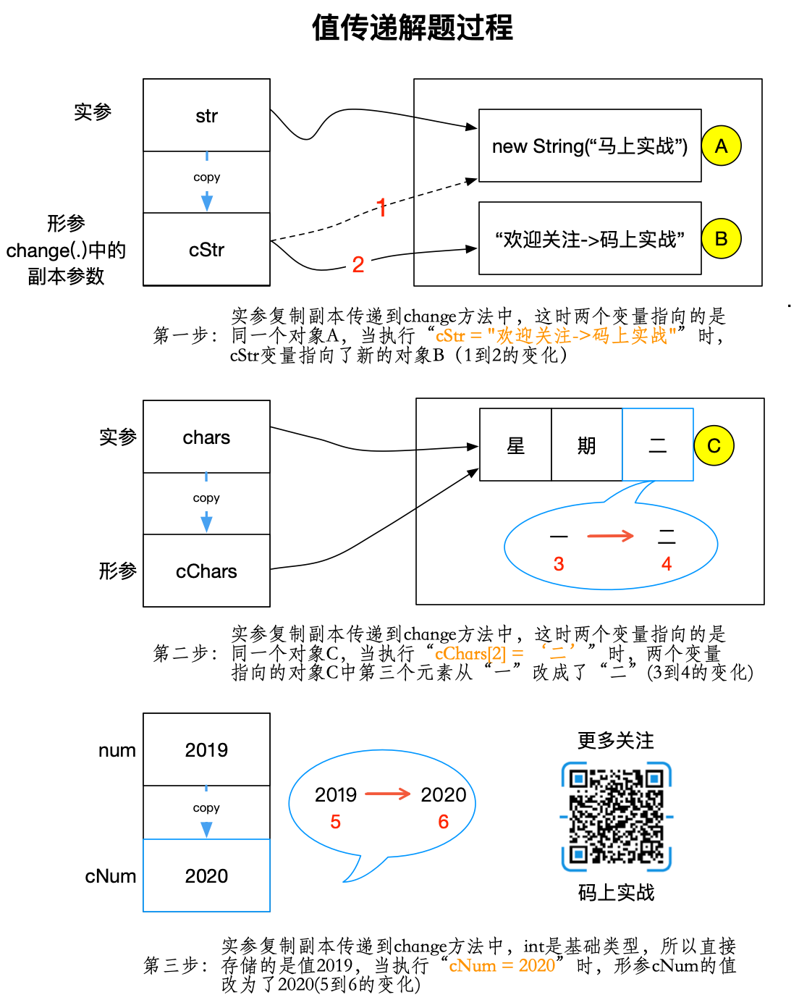

即使工作过一阶段的人也不一定能够理解Java是值传递还是引用传递。若不信，那么来看看下面这道题。

<!--more-->

## 题目

请先写出你的答案，然后对比下输出结果。

```java
public class Test {
    private String str = new String("码上实战");
    private char[] chars = {'星', '期', '一'};
    private int num = 2019;


    private void change(String cStr, char[] cChars, int cNum) {
        cStr = "欢迎关注->码上实战"; //第一步
        cChars[2] = '二';  //第二步
        cNum = 2020;  //第三步
    }

    public static void main(String[] args) {
        Test test = new Test();
        test.change(test.str, test.chars, test.num);

        System.out.println("str=" + test.str);
        System.out.println("chars=" + test.chars[0] + "," + test.chars[1] + "," + test.chars[2]);
        System.out.println("num=" + test.num);
    }
}
```

- 输出结果

```
str=码上实战
chars=星,期,二
num=2019
```

## 值传递还是引用传递？

首先，明确的告诉大家，Java只有值传递，没有引用传递！无论理解不理解，先记住这点。

### 概念

- 值传递
方法调用时，实参的数值被复制到另一个变量，然后传递复制的对象。

- 引用传递
方法调用时，实际参数的地址直接传递到方法中。

- 对比

     -|值传递|引用传递
     ---|---|---
     区别 | 创建副本  |   不创建副本
     改变| 函数中无法改变实际参数  |函数中可以改变原始实际参数  

- 注意  
这下你看清了吧，值传递和引用传递的真正区别是：**传递时，实际参数是否复制了副本！**  不要去管参数是基本类型还是引用类型。

## 解题



- 为什么char数组中改变了？
因为 实参和形参指向的是同一个数组对象，方法中改变的不是参数本身，而是改变了它所指向的对象。

- 错误的区分基本类型和引用类型
由题可知，无论是String还是int，即使在方法中都进行改变，但实参都没有改变，所以和参数什么类型没有关系。


如果你有什么问题，欢迎留言交流。