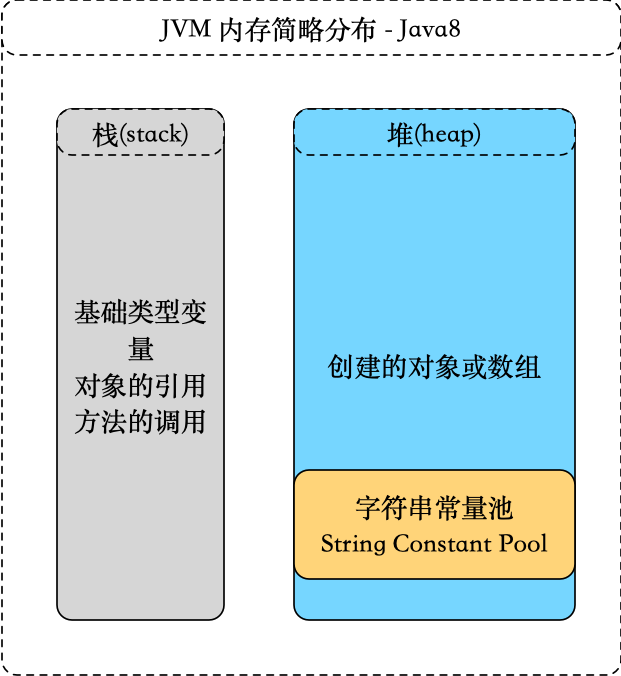

字符串广泛应用 在Java 编程中，在 Java 中字符串属于对象，Java 提供了 String 类来创建和操作字符串。

<!-- more -->

##  String 简介

String定义:

```Java
public final class String
    implements java.io.Serializable, Comparable<String>, CharSequence {}
```
### 为什么设计为不可变类呢？
> String设计为不可变类主要考虑到：效率和安全。
- 效率：1.在早期的JVM实现版本中，被final修饰的方法会被转为内嵌调用以提升执行效率。而从Java SE5/6开始，就渐渐摈弃这种方式了。因此在现在的Java SE版本中，不需要考虑用final去提升方法调用效率。只有在确定不想让该方法被覆盖时，才将方法设置为final。2.缓存hashcode，String不可变，所以hashcode不变，这样缓存才有意义，不必重新计算。
- 安全：String常被作为网络连接，文件操作等参数类型，倘若可改变，会出现意想不到的结果。


##  测试掌握程度

为了不浪费你的时间，请看下面的题目，若你一目了然，可以跳过本文了。

```Java
public class Test {
    public static void main(String[] args) {
        String str1 = "HelloFlyapi";
        String str2 = "HelloFlyapi";
        String str3 = new String("HelloFlyapi");
        String str4 = "Hello";
        String str5 = "Flyapi";
        String str6 = "Hello" + "Flyapi";
        String str7 = str4 + str5;

        System.out.println("str1 == str2 result: " + (str1 == str2));

        System.out.println("str1 == str3 result: " + (str1 == str3));

        System.out.println("str1 == str6 result: " + (str1 == str6));

        System.out.println("str1 == str7 result: " + (str1 == str7));

        System.out.println("str1 == str7.intern() result: " + (str1 == str7.intern()));

        System.out.println("str3 == str3.intern() result: " + (str3 == str3.intern()));
    }
}


```
##  String 的创建方式

从上面的题中你会知道，String的创建方式有两种：

###  直接赋值

- 此方式在方法区中字符串常量池中创建对象
    ```
    String str = "flyapi";
    ```

###  构造器

- 此方式在堆内存创建对象

    ```
    String str = new String();
    ```

##  分析
要理解String，那么要了解JVM内存中的栈(stack)、堆(heap)和方法区。简要图如下：



- str1 == str2

    ```
    String str1 = "HelloFlyapi";
    String str2 = "HelloFlyapi";
    
    System.out.println(str1 == str2); // true
    ```
当执行第一句时，JVM会先去常量池中查找是否存在HelloFlyapi，当存在时直接返回常量池里的引用；当不存在时，会在字符创常量池中创建一个对象并返回引用。

当执行第二句时，同样的道理，由于第一句已经在常量池中创建了，所以直接返回上句创建的对象的引用。

- str1 == str3

    ```
    String str1 = "HelloFlyapi";
    String str3 = new String("HelloFlyapi");
    
    System.out.println(str1 == str3); // false
    ```
执行第一句，同上第一句。

执行第二句时，会在堆（heap）中创建一个对象，当字符创常量池中没有‘HelloFlyapi’时，会在常量池中也创建一个对象；当常量池中已经存在了，就不会创建新的了。

- str1 == str6

    ```
    String str1 = "HelloFlyapi";
    String str6 = "Hello" + "Flyapi";
    
    System.out.println(str1 == str6); // true
    ```
由于"Hello"和"Flyapi"都是常量，编译时，第二句会被自动编译为‘String str6 = "HelloFlyapi";’

- str1 == str7

    ```
    String str1 = "HelloFlyapi";
    String str4 = "Hello";
    String str5 = "Flyapi";
    String str7 = str4 + str5;
    
    System.out.println(str1 == str7); // false
    ```
其中前三句变量存储的是常量池中的引用地址。

第四句执行时，JVM会在堆（heap）中创建一个以str4为基础的一个StringBuilder对象，然后调用StringBuilder的append()方法完成与str5的合并，之后会调用toString()方法在堆（heap）中创建一个String对象，并把这个String对象的引用赋给str7。

##  常用方法
下面是 String 类支持的方法，更多详细，参看 Java String API 文档:


方法|描述
---|---
char charAt(int index)|返回指定索引处的 char 值。
int compareTo(Object o)|把这个字符串和另一个对象比较。
int compareTo(String anotherString)|按字典顺序比较两个字符串。
boolean endsWith(String suffix)|测试此字符串是否以指定的后缀结束。
boolean equals(Object anObject)|将此字符串与指定的对象比较。
boolean equalsIgnoreCase(String anotherString)|将此 String 与另一个 String 比较，不考虑大小写。
byte[] getBytes()| 使用平台的默认字符集将此 String 编码为 byte 序列，并将结果存储到一个新的 byte 数组中。
byte[] getBytes(String charsetName)|使用指定的字符集将此 String 编码为 byte 序列，并将结果存储到一个新的 byte 数组中。
int indexOf(int ch)|返回指定字符在此字符串中第一次出现处的索引。
int indexOf(int ch, int fromIndex)|返回在此字符串中第一次出现指定字符处的索引，从指定的索引开始搜索。
int indexOf(String str)| 返回指定子字符串在此字符串中第一次出现处的索引。
int indexOf(String str, int fromIndex)|返回指定子字符串在此字符串中第一次出现处的索引，从指定的索引开始。
String intern()| 返回字符串对象的规范化表示形式。
int lastIndexOf(int ch)| 返回指定字符在此字符串中最后一次出现处的索引。
int lastIndexOf(int ch, int fromIndex)|返回指定字符在此字符串中最后一次出现处的索引，从指定的索引处开始进行反向搜索。
int lastIndexOf(String str)|返回指定子字符串在此字符串中最右边出现处的索引。
int lastIndexOf(String str, int fromIndex)| 返回指定子字符串在此字符串中最后一次出现处的索引，从指定的索引开始反向搜索。
int length()|返回此字符串的长度。
boolean matches(String regex)|告知此字符串是否匹配给定的正则表达式。
String replace(char oldChar, char newChar)|返回一个新的字符串，它是通过用 newChar 替换此字符串中出现的所有 oldChar 得到的。
String replaceAll(String regex, String replacement)|使用给定的 replacement 替换此字符串所有匹配给定的正则表达式的子字符串。
String replaceFirst(String regex, String replacement)| 使用给定的 replacement 替换此字符串匹配给定的正则表达式的第一个子字符串。
String[] split(String regex)|根据给定正则表达式的匹配拆分此字符串。
String[] split(String regex, int limit)|根据匹配给定的正则表达式来拆分此字符串。
boolean startsWith(String prefix)|测试此字符串是否以指定的前缀开始。
boolean startsWith(String prefix, int toffset)|测试此字符串从指定索引开始的子字符串是否以指定前缀开始。
String substring(int beginIndex)|返回一个新的字符串，它是此字符串的一个子字符串。
String substring(int beginIndex, int endIndex)|返回一个新字符串，它是此字符串的一个子字符串。
char[] toCharArray()|将此字符串转换为一个新的字符数组。
String toLowerCase()|使用默认语言环境的规则将此 String 中的所有字符都转换为小写。
String toUpperCase()|使用默认语言环境的规则将此 String 中的所有字符都转换为大写。
String trim()|返回字符串的副本，忽略前导空白和尾部空白。

##  String相关

由于String的不可变性导致，字符串变更时效率低下，在之后得JDK版本中出现了StringBuilder和StringBuffer.

类	|可变性|	线程安全
---|---|---
String|	不可变|	安全
StringBuffer|	可变|	安全
StringBuilder|	可变|	非安全

- 使用选择
1. 当有少量连接操作时，使用String
2. 当单线程下有大量连接操作时，使用StringBuilder
3. 当多线程下有大量连接操作时，使用StringBuffer

##  常见String面试题

- String str = new String("abc")创建了多少个实例？

这个问题其实是不严谨的，但面试一般会遇到，所以我们要补充来说明。

> 类的加载和执行要分开来讲：
> 创建了两个
> 1. 当加载类时，"abc"被创建并驻留在了字符创常量池中（如果先前加载中没有创建驻留过）。
> 2. 当执行此句时，因为"abc"对应的String实例已经存在于字符串常量池中，所以JVM会将此实例复制到会在堆（heap）中并返回引用地址。

通过字节码我们可以看到：

源码：String str = new String("abc")

字节码：
```
    Code:
       0: new           #2                  // class java/lang/String
       3: dup
       4: ldc           #3                  // String abc
       6: invokespecial #4                  // Method java/lang/String."<init>":(Ljava/lang/String;)V
       9: astore_1
      10: return
```
执行时仅(#2)创建了一个对象。

> 关于这个面试题，可以看看一个超大牛的回答：http://rednaxelafx.iteye.com/blog/774673


本文优先发布于微信公众号和GitHub上。

[GitHub flyhero](https://github.com/flyhero/notebook)
