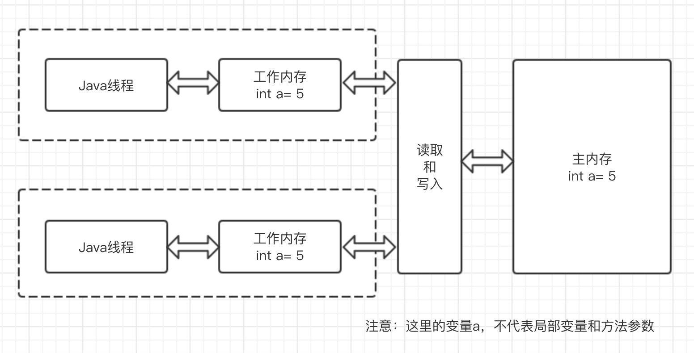
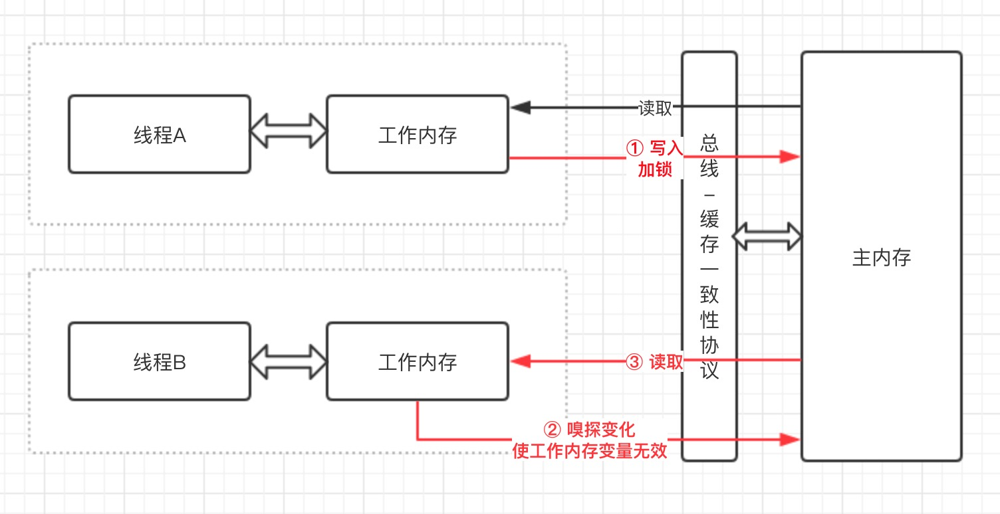

最主要的一句话先甩出来：volatile并不能保证变量是线程安全的，只能保证线程能够获的取变量最新值。

<!--more-->

为什么大家总是说 volatile 是轻量级的 synchronized ？轻量级因为它拥有较少的编码和运行开销，也不会造成阻塞，但代价是并不拥有synchronized的全部能力。

## 名词解释

- 共享变量

如果一个变量在多个线程的工作内存中存在副本，那么这个变量叫做共享变量。

- 可见性

如果一个线程对共享变量的修改，能及时的被其他线程看到，叫做共享变量的可见性。

- 原子性

不可中断的一个或一系列操作。

## Java内存模型

我们先来看看一张图



1. Java内存模型规定了所有变量都存储在主内存，每个线程还有自己的工作内存，线程的工作内存保存了被该线程使用到的变量的主内存的副本拷贝。

2. 线程对变量的所有读写操作都必须在工作内存中进行，而不是直接读写主内存的变量，不同线程间也不能相互访问对方的工作内存。

3. 当线程对自己工作内存中的变量操作后，之后会刷新到主内存中，然后其他线程再次读取主内存中的变量才能获取到最新值。

所以这样就造成了一些线程读取的变量不是最新的！那么volatile是怎么解决这个问题的呢？



加入volatile关键字修饰变量后，线程对变量的操作能立马反馈的主内存中，其他线程嗅探到变化，使工作内存变量无效，使用时再次从主存中读取，这样对于其他线程读取的都是最新的值。

## 举例

### 可见性

```java
public class Test {

    public boolean flag = false;

    public void waiting() {
        System.out.println("等待flag改变……");
        while (!flag) {
        }
        System.out.println("flag改变完毕……" + flag);
    }
    
    public void change() {
        System.out.println("改变flag");
        flag = true;
    }

    public static void main(String[] args) throws InterruptedException {
        Test test = new Test();
        new Thread(() -> test.waiting()).start();
        Thread.sleep(3000L);
        new Thread(() -> test.change()).start();
    }
}
```

执行上面代码，你会发现第一个线程一直处于等待中, 这就符合了上面内存模型的解释了。

然后把变量flag加上关键字volatile，再次运行，你会发现改变flag后，线程就立刻运行结束了。

### 线程不安全情况

```java
public class Test {

    public volatile int count = 0;

    public void change() {
        for (int i = 0; i < 100000; i++) {
            count++;
        }
    }

    public static void main(String[] args) throws InterruptedException {
        Test test = new Test();
        new Thread(() -> test.change()).start();
        new Thread(() -> test.change()).start();
        new Thread(() -> test.change()).start();
        Thread.sleep(2000L);
        System.out.println(test.count);
    }
}
```
上面代码中变量count加上了volatile关键字，我们期望三个线程执行后，得出count的值为30万。但实际得出的却远远不足30万。

因为volatile对变量本身的单次读写具有原子性，但`count++`并不是原子操作，它实际上有三步（读取-修改-写入），当多个线程同时进入这三步中，就会出现问题。

但是它也有线程安全的场景，接下来聊聊。

## 使用条件

volatile 不能代替 synchronized , 但在有限的条件下可以用于线程安全，必须同时满足下面两条件：

1. 对变量的写不能依赖于当前变量的值。（反例：`count = count + 1`）
2. 当前 volatile 变量不包含在其他变量的不变式中。（反例：`volatile1 < var2`恒成立)

大多数编程场景都会与这两个条件之一冲突，这也就造就了 volatile 的使用不像 synchronized 那么普遍。


## 平时使用的场景

### 状态标记量

这个我们已经在可见性中写出了。这类有个共性就是：状态标记量不依赖于程序内其他状态，通常只有一种状态转换。

### 双重检测

```java
class Singleton{
    
    private volatile static Singleton instance = null;
     
    private Singleton() {
         
    }
     
    public static Singleton getInstance() {
        if(instance==null) {
            synchronized (Singleton.class) {
                if(instance==null)
                    instance = new Singleton();
            }
        }
        return instance;
    }
}
```
这类结合了 synchronized 实现了 volatile 变量的唯一赋值，当赋值成功后其他线程在获取锁之前便可立即知道变量的变化。