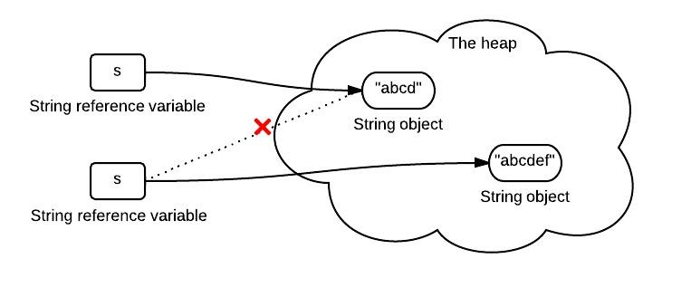

正所谓一图胜千言，下面八张图将带你回顾或新认识一下八个Java知识点。

<!-- more -->

## String不变性

下面的图展示了这段代码发生了什么：
```java
String s = "abcd";
s = s.concat("ef");
```


## The equals() 和 hashCode() 的契约

HashCode 设计用于提升性能. equals() 和 hasCode() 的契约如下:
1. 如果两个对象是相等的，那么他们必须拥有相同的hashcode。
2. 如果两个对象拥有相同的hashcode，那么他们可能相等也可能不相等。


## Java Exception 类的结构

红色的是受检异常，在方法中它必须被捕获或声明throws。


## Collections 类的结构

注意 Collections 和 Collection 之间的不同之处。


## Java synchronization

Java同步机制可以通过类似于建筑物来说明。


## 别名

别名意味着可以更新的位置有多个别名，这些别名具有不同的类型。


## 堆和栈

这张图展示了方法和对象在运行时内存中的位置。


## JVM 运行时数据区

这张图展示了JVM 运行时数据区。


JVM runtime data area