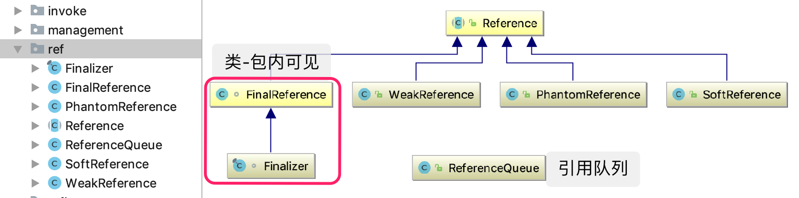
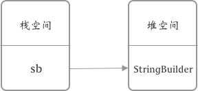
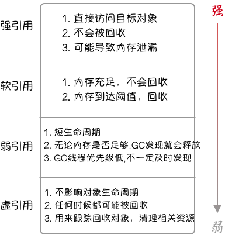

```
title: 强、软、弱、虚引用的区别和使用
categories: Java基础
tags: [Java]
date: 2019-10-04 19:35:29
```


Java提供了四种级别的应用类型：强引用、软引用、弱引用及虚引用。那么这四种引用类型有什么区别呢？

<!-- more-->

首先我们通过一张图来看看四种引用在Java中的表示：




## FinalReference

由于FinalReference是包内可见，Finalizer是其唯一的扩展类。在外部是无法直接使用这两个类的，因为FinalReference引用类型是为JVM提供的，JVM会对那些实现了 Object 中 finalize() 方法的类实例化一个对应的FinalReference，提供 对象被 GC 前需要执行 finalize 方法的对象 的机制。这里不详细介绍。


## 强引用（StrongReference）

强引用在 java.lang.ref 中并没有实际的对应类型，但我们程序中几乎所有的引用使用的都是强引用。

```java
StringBuilder sb = new StringBuilder(); 
```



上面通过在堆中创建实例，然后赋值给栈中局部变量 sb 的方式 就是 强引用。

强引用有如下特点：

- 强引用可以直接访问目标对象
- 强引用(存在)指向的对象任何时候都不会被回收，JVM宁愿抛出OOM异常，也不会回收。
- 强引用可能会导致内存泄漏

注意： 为了尽量避免内存不足的情况，我们可以在变量sb使用后通过显示的将变量sb置为null，来加速对象的回收。

解释： 1. 内存溢出(out of memory) 是指 程序在申请内存时，没有足够的内存空间供其使用，出现 out of memory.

2. 内存泄漏(memory leak) 是指 程序申请内存后，无法释放已申请的内存空间，这样的泄漏积少成多，memory leak 会导致 out of memory .


## 软引用（SoftReference）

软引用对应的类为 java.lang.ref.SoftReference, 一个软引用中的对象，不会很快被JVM回收，JVM会根据当前堆的使用情况来判断何时回收，当堆的使用率超过阈值时，才回去回收软引用中的对象。

先通过一个例子来了解一下软引用：

```java
Object obj = new Object();
SoftReference softRef = new SoftReference<Object>(obj);
//删除强引用
obj = null;
//调用gc
System.gc();
System.out.println("gc之后的值：" + softRef.get()); // 对象依然存在
```

软引用也可以和一个引用队列联合使用，如果软引用中的对象（obj）被回收，那么软引用会被 JVM 加入关联的引用队列中。

```java
ReferenceQueue<Object> queue = new ReferenceQueue<>();
Object obj = new Object();
SoftReference softRef = new SoftReference<Object>(obj,queue);
//删除强引用
obj = null;
//调用gc
System.gc();
System.out.println("gc之后的值: " + softRef.get()); // 对象依然存在
//申请较大内存使内存空间使用率达到阈值，强迫gc
byte[] bytes = new byte[100 * 1024 * 1024];
//如果obj被回收，则软引用会进入引用队列
Reference<?> reference = queue.remove();
if (reference != null){
    System.out.println("对象已被回收: "+ reference.get());  // 对象为null
}
```

### 引用队列（ReferenceQueue）作用

Queue的意义在于我们在外部可以对queue中的引用进行监控，当引用中的对象被回收后，我们可以对引用对象本身继续做一些清理操作，因为我们引用对象（softRef）也占有一定的资源。


## 弱引用（WeakReference）

弱引用中的对象具有很短的声明周期，因为在系统GC时，只要发现弱引用，不管堆空间是否足够，都会将对象进行回收。由于垃圾回收器是一个**优先级很低的线程**，因此**不一定**会**很快**发现那些只具有**弱引用**的对象。

弱引用的简单使用：

```java
Object obj = new Object();
WeakReference weakRef = new WeakReference<Object>(obj);
//删除强引用
obj = null;
System.out.println("gc之后的值：" + weakRef.get()); // 对象依然存在
//调用gc
System.gc();
System.out.println("gc之后的值：" + weakRef.get()); // 对象为null
```

弱引用也可以和一个引用队列联合使用，如果弱引用中的对象（obj）被回收，那么软引用会被 JVM 加入关联的引用队列中。

```java
ReferenceQueue<Object> queue = new ReferenceQueue<>();
Object obj = new Object();
WeakReference weakRef = new WeakReference<Object>(obj,queue);
//删除强引用
obj = null;
System.out.println("gc之后的值: " + weakRef.get()); // 对象依然存在
//调用gc
System.gc();
//如果obj被回收，则软引用会进入引用队列
Reference<?> reference = queue.remove();
if (reference != null){
    System.out.println("对象已被回收: "+ reference.get());  // 对象为null
}
```

> 软引用和弱引用都非常适合保存那些可有可无的缓存数据，当内存不足时，缓存数据被回收（再通过备选方案查询），当内存充足时，也可以存在较长时间，起到加速的作用。

### 应用

- WeakHashMap

  当key只有弱引用时，GC发现后会自动清理键和值，作为简单的缓存表解决方案。

- ThreadLocal

  ThreadLocal.ThreadLocalMap.Entry 继承了弱引用，key为当前线程实例，和WeakHashMap基本相同。


## 虚引用（PhantomReference）

虚引用 就是 形同虚设 ，它并不能决定 对象的生命周期。任何时候这个只有虚引用的对象都有可能被回收。因此，虚引用主要用来跟踪对象的回收，清理被销毁对象的相关资源。PhantomReference的 get() 方法永远返回null ，而且只提供了与引用队列同用的构造函数。所以虚引用必须和引用队列一同使用。

```java
Map<Object, String> map = new HashMap<>();
ReferenceQueue<Object> queue = new ReferenceQueue<>();
Object obj = new Object();
PhantomReference phantomRef = new PhantomReference<Object>(obj,queue);
map.put(obj,"obj val");
new CheckRefQueue(queue,map).start();
//删除强引用
obj = null;
Thread.sleep(1000);
int i = 1;
while (true){
    System.out.println("第"+i+"次gc");
    System.gc();
    Thread.sleep(1000);
}
```

```java
public class CheckRefQueue extends Thread {

    private ReferenceQueue queue;
    private Map<Object, String> map;

    public CheckRefQueue(ReferenceQueue queue, Map<Object, String> map) {
        this.queue = queue;
        this.map = map;
    }

    @Override
    public void run() {
        // 等待，直到对象呗回收
        Reference reference = queue.remove();
        // 释放引用对象的引用
        map.remove(reference.get());
    }
}
```


## 总结



