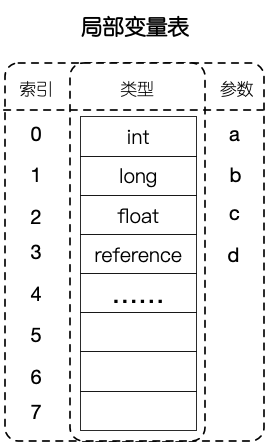
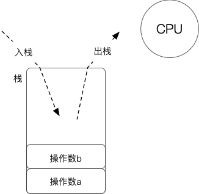
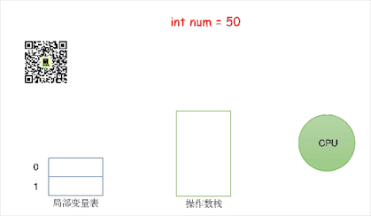
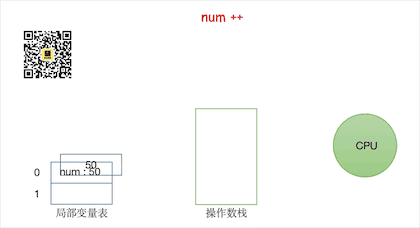

面对i++和++i,是不是经常忘记两者的区别？你是真的理解它还是只是靠死记硬背记住的它？
如果你能以下面第一段的方式解释它，那么可能还不是很理解 i++ ,若果要理解它需要你了解更多的知识。

```java
public class Plus {
    public static void main(String args[]) {
        int num = 50;
        num = num++ * 2;
        System.out.println(num);
    }
}
```


## 1. 表面

num++ 是将原值先拿出来，自身再+1，此时num=51，然后将 50*2=100 再赋值给num，所以100覆盖了原来的51。

这么回答是对的，大部分人可能都会这么回答，但你还能再深入点吗？


## 2. JVM字节码指令解读

要理解这一层次，你需要先了解一下JVM的内存结构-虚拟机栈

### 2.1 虚拟机栈

我们应该清楚 JVM 内存中有如下几个部分：


我们主要要了解虚拟机栈中运算是如何进行的，这里着重看局部变量表和操作数栈：

**局部变量表**：用于存放各种基本数据类型或对象引用，就是方法内定义的局部变量，其存储单元为slot槽（double/long占两个slot，其他均占一个slot）；JVM会为局部变量表中的每一个slot都分配一个访问索引，通过这个索引即可成功访问到局部变量表中指定的局部变量值。



**操作数栈**：这是一个栈的数据结构，可入栈弹出，将局部变量表中的变量放入栈中或弹出，CPU在计算时会从栈中取出并计算，然后计算结果再入栈。



### 2.2 字节码指令

这里列出一些会用到的字节码指令：

| 指令     | 意义                                  |
| -------- | ------------------------------------- |
| bipush   | 将单字节的常量值(-128~127)推送至栈顶  |
| istore_n | 将栈顶int型数值存入第n个本地变量      |
| iload_n  | 将第n个int型本地变量推送至栈顶        |
| Iinc     | 局部变量自增指令                      |
| iconst_n | 将int型常量n推送至栈顶(n<=5)          |
| imul     | 将栈顶两int型数值相乘并将结果压入栈顶 |

在IDEA中安装bytecode插件，点击 `view -> show bytecode` 将上面的程序转为字节码指令来看看他是如何做的：


```jshelllanguage
L0

 //将50推送至栈顶
 BIPUSH 50
 
 //将50取出存储到第一个变量中
 ISTORE 1
 
L1
 
 //将第一个变量中50推送至栈顶
 ILOAD 1
 
 //将第一个变量进行加1操作，此时局部变量num=51
 IINC 1 1
 
 //将常量2推送至栈顶，此时栈中有两个数50，2
 ICONST_2
 
 //将栈中的数进行相乘，然后放入栈顶 50*2 = 100
 IMUL
   
 //取出栈顶元素100存入第一个变量中，num = 100
 ISTORE 1
```

如果你之前没有了解过字节码相关的东西，那么你看上面可能有些吃力，所以我制作了动画给你看（善良不？）：

动画解析：






更善良的是：如果你想要上面动画的源文件，公众号回复 “ i++ ” 即可。

### 2.3 扩展

如果将上面代码中的 `num++ ` 替换成  `++num ` 结果会怎么呢？

这两者的不同在于  `ILOAD 1`  和  `IINC 1 1` 的顺序，是先将变量放入操作数栈中再将变量加1 还是 先将变量加1再将变量放入操作数栈中。


看到这，你应该 知其然知其所以然了吧……