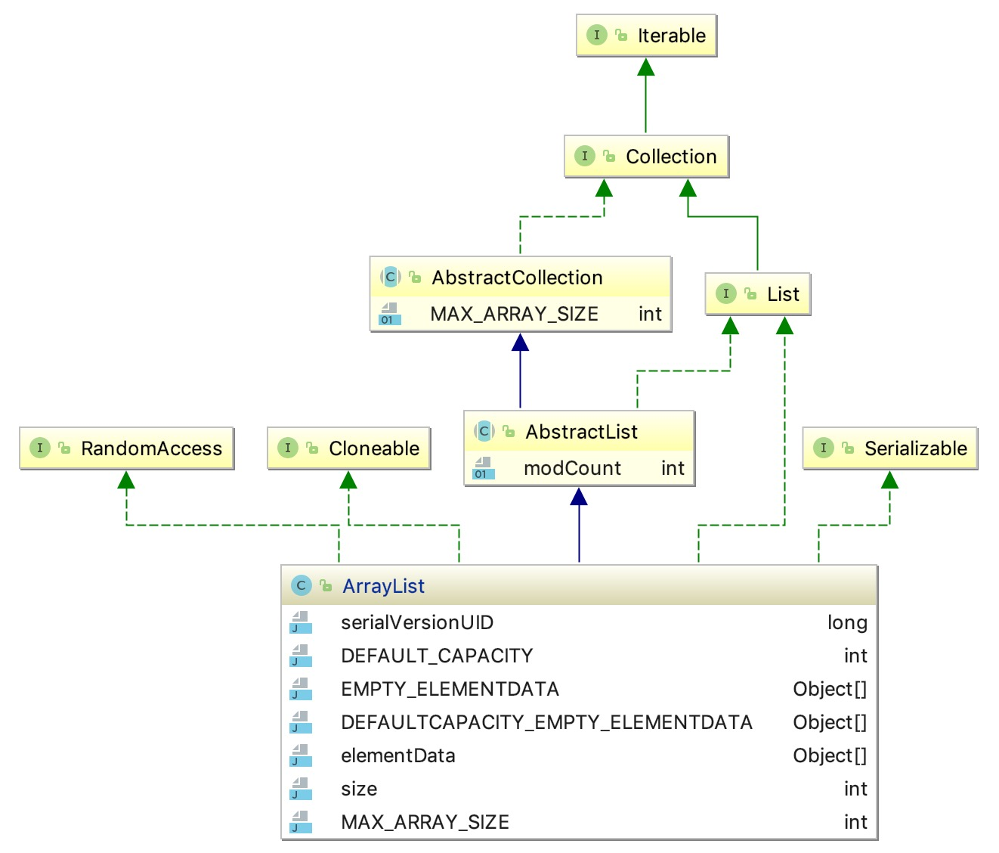
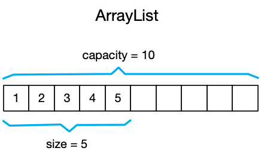
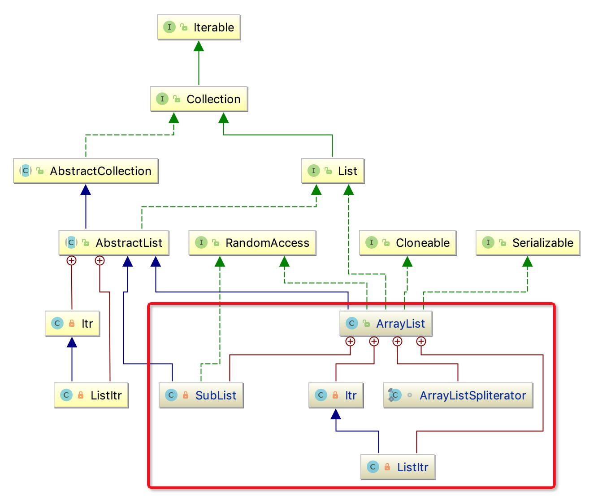

源码还是比较多的，安安静静的读完确实不易，所以我们读源码要有着重点。

- ArrayList的继承和实现关系
- ArrayList的成员属性
- ArrayList的构造
- ArrayList的容量与扩容问题
- ArrayList的遍历删除修改操作


## 继承和实现

看下ArrayList的定义：

```java
public class ArrayList<E> extends AbstractList<E>
        implements List<E>, RandomAccess, Cloneable, java.io.Serializable {}
```

ArrayList继承了 抽象类AbstractList，实现了 List接口，并且实现了RandomAccess, Cloneable, java.io.Serializable这三个标记接口，标记接口中是没有
声明任何方法的，没有方法并不代表没有用，他们分别表示ArrayList具有可随机访问，可克隆及可序列化能力。

我们通过一张UML图来看可能更直观：


## 成员属性



- 初始化容器常量

```java
/**
 * 静态常量 空数组  用于返回 元素为空的实例
 */
private static final Object[] EMPTY_ELEMENTDATA = {};

/**
 * 空数组 和 EMPTY_ELEMENTDATA 用于区别，以便在第一个元素添加时知道扩容多少
 */
private static final Object[] DEFAULTCAPACITY_EMPTY_ELEMENTDATA = {};
```

- 修改次数

```java
//用来记录集合结构变动的次数
protected transient int modCount = 0;
```
- 默认容量

```java
/**
 * 静态常量  默认容量
 */
private static final int DEFAULT_CAPACITY = 10;

/**
 * 包含元素的数量，私有变量只能通过size()方法获得
 */
private int size;

/**
 * 数组的最大长度，一些虚拟机在存储数组对象时会将一些头信息存入其中，
 * 分配过大的数组空间很可能导致 OOM，数组长度超过VM的限制。
 */
private static final int MAX_ARRAY_SIZE = Integer.MAX_VALUE - 8;
```

看到上面的 **DEFAULT_CAPACITY**，你是不是真的信了，默认容量是10 ？ （稍后揭晓）

- 存储容器

```java
/**
 * 声明一个默认权限的数组,用以存储元素,只能在本类或本包中访问
 */
transient Object[] elementData; 
```
上面这些成员中，主角就是 **elementData**，这个数组就是我们存储对象的地方。

为什么使用数组呢？那么来补补数组的知识。

### 数组

1. 数组 和其他容器之间的区别有三方面：效率，类型和保存基本类型的能力。

2. 数组是一种效率最高的的存储和随机访问对象的方式，它是一种简单的线性序列，这使得元素访问非常快速，但代价是它的长度是被固定的，在它生命周期中是不可以变更的。

3. 访问数组的唯一方式就是使用数组索引，即我们常说的下标。




### 内部类及嵌套类




- SubList

ArrayList的一个子集视图，为什么说是视图呢？因为它展示的就是ArrayList中的部分元素，无论改变它本身还是ArrayList，双方都会手影响。

- Itr

迭代器Iterator接口的实现类

- ListItr

继承于Itr，是Itr的功能增强版

- ArrayListSpliterator

分割迭代器，可以将迭代器分割一分为二，依次类推


## 构造ArrayList

我们都用过 ArrayList ，但最常用的应该是 `new ArrayList()` 或者 `new ArrayList(10)` 吧！

其实构造方法有三种，我们依次来看看：

### 指定容量构造

```java
public ArrayList(int initialCapacity) {
    if (initialCapacity > 0) {
        this.elementData = new Object[initialCapacity];
    } else if (initialCapacity == 0) {
        this.elementData = EMPTY_ELEMENTDATA;
    } else {
        throw new IllegalArgumentException("Illegal Capacity: " +
                   initialCapacity);
    }
}
```
1. 指定初始容量后便创建一个指定大小的数组赋值给elementData
2. 如果指定容量为0，则将elementData指向上面成员常量中的第一个空数组
3. 若指定容量为负数，则抛出异常

### 无參构造

```java
public ArrayList() {
    this.elementData = DEFAULTCAPACITY_EMPTY_ELEMENTDATA;
}
```

嗨！有没有发现不对啊？ 不是说好的默认容量是10吗？ 那这句话是嘛意思？这明显是是赋了一个空数组嘛……

其实在之前的1.6版本中确实初始化时是10，你看：

```java
public ArrayList() {
    //这里调用第一个指定容量的构造方法，传入了10作为初始容量
     this(10);  
 }  
```

### 指定集合构造

```java
public ArrayList(Collection<? extends E> c) {
    //调用集合的toArray()方法将集合转为数组
    elementData = c.toArray();
    if ((size = elementData.length) != 0) {
        // c.toArray might (incorrectly) not return Object[] (see 6260652)
        if (elementData.getClass() != Object[].class)
            elementData = Arrays.copyOf(elementData, size, Object[].class);
    } else {
        // replace with empty array.
        this.elementData = EMPTY_ELEMENTDATA;
    }
}
```
这里主要是将传入的集合通过`toArray()`转为数组，然后赋值给`elementData`。

## 容量与扩容

继续说说默认容量这回事，如今的版本中数组初始化时的容量确实为0，作者把默认容量从初始化时延迟到了第一次添加元素时。

```java
public boolean add(E e) {
    //判断是否扩容
    ensureCapacityInternal(size + 1); 
    elementData[size++] = e;
    return true;
}
private void ensureCapacityInternal(int minCapacity) {
    //如果当前集合中元素为空，那么 选取 默认容量和最小容量 中的最大值
    if (elementData == DEFAULTCAPACITY_EMPTY_ELEMENTDATA) {
        minCapacity = Math.max(DEFAULT_CAPACITY, minCapacity);
    }

    ensureExplicitCapacity(minCapacity);
}
private void ensureExplicitCapacity(int minCapacity) {
    modCount++;

    // 扩容时机：当容量全部被占用完时，那么进行扩容
    if (minCapacity - elementData.length > 0)
        grow(minCapacity);
}
```

抓住上面的3个重点：
1. 添加元素时都会判断当前是否需要扩容
2. 如果构造集合时指定默认容量，那么本次扩容到10
3. 只有当容量全部被占用时才会扩容（除主动扩容和第2条时）

```java
private void grow(int minCapacity) {
    int oldCapacity = elementData.length;

    //新容量为原来的1.5倍
    int newCapacity = oldCapacity + (oldCapacity >> 1);

    //如果扩容1.5倍后还不满足需要的最小容量
    // 那么就直接扩容到所需的最小容量
    if (newCapacity - minCapacity < 0)
        newCapacity = minCapacity;
    //复制原来数组元素到一个新长度的数组中
    elementData = Arrays.copyOf(elementData, newCapacity);
}
```
这段代码展示的是扩容到多大，`oldCapacity >> 1` 就相当于 oldCapacity/2, 把容量扩大到原来的1.5倍。

## 遍历修改删除操作

```java
List<String> list = new ArrayList<>(Arrays.asList("code","code","test","hello"));
```

### 错误一

```java
for(inti=0;i<list.size();i++){
    String a=list.get(i);
    if (a.equals("code")) {
        list.remove(a);
    }
 }
```

为什么第二个code没有被删除？你会发现它删除的元素之后的一个元素会被遍历跳过。

因为删除元素后，其右边的所有元素都往前移动了一位，而你的下标却一直增加。

### 错误二

```java
for (String s: list) {
    if (s.equals("code")){
        list.remove(s);
    }
}
```
你将会得到一个`ConcurrentModificationException`异常。

### 错误三

```java
list.forEach(s -> {
    list.remove(s);
});
```
你同样得到一个`ConcurrentModificationException`异常。

好吧，这下看出问题了，只要你在遍历list时调用自身的`remove`方法，都是不对的。

### 分析

错误二使用的其实是Iterator的方式遍历的，错误三使用的是forEach方法，我们看下源码都发现了一个共同之处：
```java
int expectedModCount = modCount;
//省略步骤
if (modCount != expectedModCount)
    throw new ConcurrentModificationException();
```
如果再遍历的过程中，modCount发生了改变(remove,set等)就会导出抛出异常。

#### 正确方式

```java
Iterator<Integer> iterator = list.iterator();
while (iterator.hasNext()){
    Integer next = iterator.next();
    iterator.remove();
}
```
为什么这样可以？

因为 `iterator.remove()`方法在删除元素后，将下标回拨了一位。

## 最后

1. ArrayList 的读取速度非常快，我想原因你应该知道了，这得益于底层的数组。
2. ArrayList 频繁扩容将会导致性能下降，因为每次扩容都会复制原来的数组到创建的新数组。
3. ArrayList 插入时会移动数组元素，插入越靠前，移动的元素就越多，效率越差。