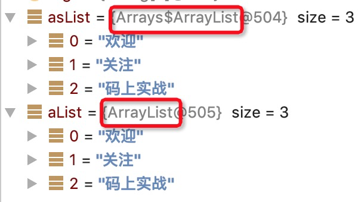
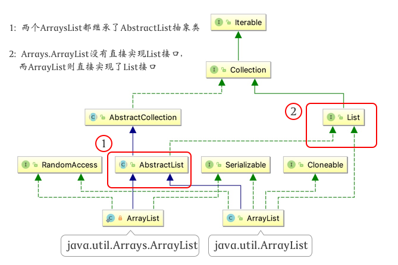

使用Arrays.asList()的原因无非是想将数组或一些元素转为集合,而你得到的集合并不一定是你想要的那个集合。

而一开始asList()的设计时用于打印数组而设计的，但jdk1.5开始，有了另一个比较更方便的打印函数Arrays.toString(),于是打印不再使用asList()，而asList()恰巧可用于将数组转为集合。

## 错误用法

如果你这样使用过，那你要注意下了。

- 错误一

将基本类型数组作为asList的参数

```java
int[] arr = {1,2,3};
List list = Arrays.asList(arr);
System.out.println(list.size());
```
猜一下输出结果？

- 错误二

将数组作为asList参数后，修改数组或List

```java
String[] arr = {"欢迎","关注","Java"};
List list = Arrays.asList(arr);
    
arr[1] = "爱上";
list.set(2,"我");
    
System.out.println(Arrays.toString(arr));
System.out.println(list.toString());
```
猜一下输出结果？


- 错误三

数组转换为集合后，进行增删元素

```java
String[] arr = {"欢迎","关注","Java"};
List list = Arrays.asList(arr);
    
list.add("新增");
list.remove("关注");
```
猜一下输出结果？


你是不是以为上面👆那个list是 java.util.ArrayList ?

答案很确定：NO!  


## 探索真理

我们通过asList()源码可发现，但为了更直观，我们通过IDEA debug来看看结果。
```java
List<String> asList = Arrays.asList("欢迎","关注","码上实战");
ArrayList<String> aList = new ArrayList<>(asList);
```




其实它返回的是 `java.util.Arrays.ArrayList` ，这个家伙是谁呢？


请看下源码：

```java
public class Arrays {
    
    //省略其他方法
    
    public static <T> List<T> asList(T... a) {
        return new ArrayList<>(a);
    }
        
    //就是这个家伙             👇
    private static class ArrayList<E> extends AbstractList<E>
            implements RandomAccess, java.io.Serializable{
    
        private final E[] a;
    
        ArrayList(E[] array) {
            a = Objects.requireNonNull(array);
        }
    
        @Override
        public int size() {
            return a.length;
        }
        //省略其他方法
    }
}
```

但它和ArrayList貌似很像唉！有什么不同吗？

### 不同之处

Arrays.ArrayList 是工具类 Arrays 的一个内部静态类，它没有完全实现List的方法，而 ArrayList直接实现了List 接口，实现了List所有方法。




- 长度不同 和 实现的方法不同

    Arrays.ArrayList是一个定长集合，因为它没有重写add,remove方法，所以一旦初始化元素后，集合的size就是不可变的。

- 参数赋值方式不同

Arrays.ArrayList将外部数组的引用直接通过“=”赋予内部的泛型数组，所以本质指向同一个数组。
    
```java
ArrayList(E[] array) {
    a = array;
}
```

ArrayList是将其他集合转为数组后copy到自己内部的数组的。
```java
public ArrayList(Collection<? extends E> c) {
    // toArray 底层使用的是 数组clone 或 System.arraycopy
    elementData = c.toArray();
}
```


## 揭晓答案

- 错误一

    由于Arrays.ArrayList参数为可变长泛型，而基本类型是无法泛型化的，所以它把int[] arr数组当成了一个泛型对象，所以集合中最终只有一个元素arr.

- 错误二

    由于asList产生的集合元素是直接引用作为参数的数组，所以当外部数组或集合改变时，数组和集合会同步变化，这在平时我们编码时可能产生莫名的问题。

- 错误三

    由于asList产生的集合并没有重写add,remove等方法，所以它会调用父类AbstractList的方法，而父类的方法中抛出的却是异常信息。

## 支持基础类型的方式

- 如果使用Spring

```java
int[]  a = {1,2,3};
List list = CollectionUtils.arrayToList(a);
System.out.println(list);
```

- 如果使用Java8

```java
int intArray[] = {1, 2, 3};
List<Integer> iList = Arrays.stream(intArray)
                            .boxed()
                            .collect(Collectors.toList());
System.out.println(iList);
```

## 数组转为ArrayList

- 遍历转换

```java
Integer intArray[] = {1, 2, 3};
ArrayList<Integer> aList = new ArrayList<>();
for (Integer i: intArray){
    aList.add(i);
}
```
    
显然这种方式不够优雅！反正我不愿意使用。

- 使用工具类

    上面方案不够优雅，那么这种相对来说优雅一些。
```java
List<String> list = new ArrayList(); 
Collections.addAll(list, "welcome", "to", "china");
```

> 你以为这种还不错？
too young too simple!
addAll()方法的实现就是用的上面遍历的方式。


- 如果使用Java8

    既可以用于基本类型也可以返回想要的集合。

```java
int intArray[] = {1, 2, 3};
List<Integer> iList = Arrays.stream(intArray)
                            .boxed()
                            .collect(Collectors.toList());
System.out.println(iList);
```

- 两个集合类结合

    将Arrays.asList返回的集合作为ArrayList的构造参数
    
```java
ArrayList arrayList = new ArrayList<>(Arrays.asList("welcome", "to", "china"));
```
    
## 最后

勿以点小而不闻！体现程序素养或许就在这些小地方，不要给自己或别人留坑。

那么这个知识点，你get到了吗？get到了，那来继续关注我。没get到？来来来，咱俩单独聊聊。

