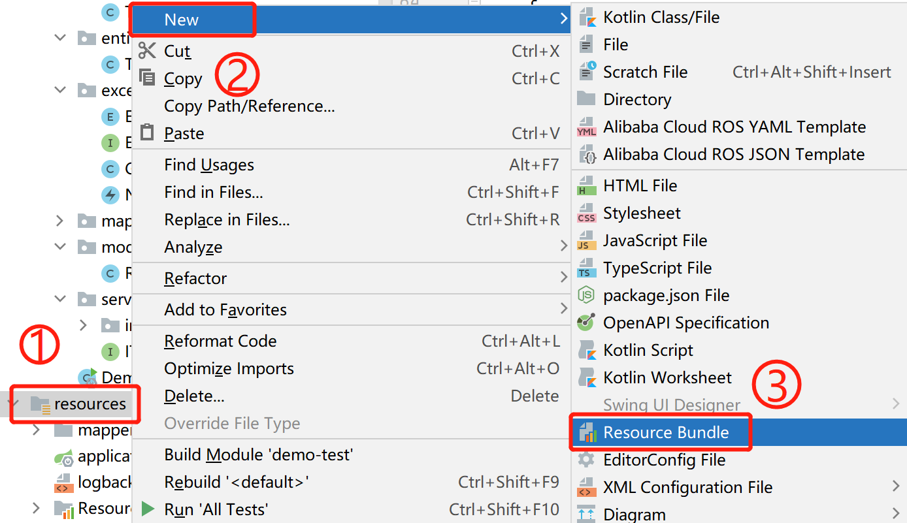
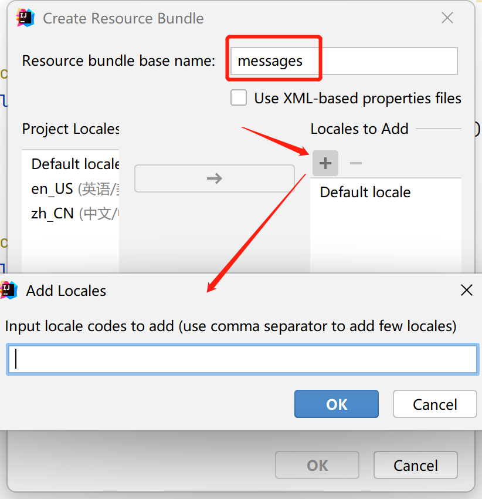
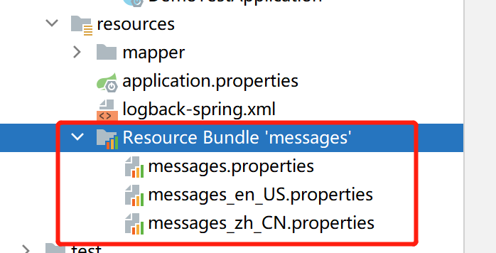
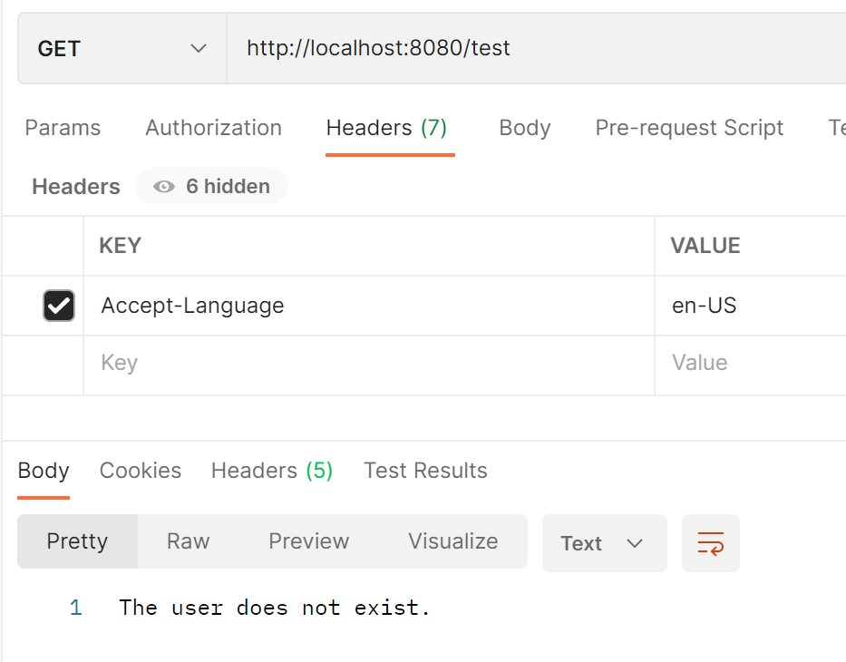

一行代码竟然实现了spring boot 国际化


摘要：你知道为什么我们把国际化叫 i18n 吗？


> 大家好！我是王不二，一个在上海打拼5年的 Java 开发者，如今已自由职业一年，目前主要接活为生，如果你也有这方面的经历，欢迎交流。


国际化的目的我就不说了，大家都知道，肯定是为了让不同语言的用户都能使用。

还有个问题，为什么我们编程环境下要把国际化叫 i18n 呢？因为国际化英文是 internationalization ，这么长的单词，即便母语是英语的人，也会嫌拼写太麻烦，所以想了一个简单的写法，就叫  i18n ，因为在 i 和 n 之间有 18 个字母。


我们接下来讨论的是目前主流的前后端分离项目中如何使用国际化。


原谅我一行代码的说法，虽然代码量少，但也还是有其他方面的工作要做的。

## 1. spring boot 国际化

### 1.1 实现步骤

#### 1.1.1 创建资源文件

1. 选择 资源文件 resources 右键  New 选择  Resource Bundle 




2. 设置 base name , 点击添加 +  按钮 ，填入一个要支持的语言，语言简称详见最后。



3. 第2步创建后会产生对应语言的属性文件，没有下划线结尾的是默认配置，文件里的格式都是以键值对的形式展示。

   

   在创建的 properties 文件中填写 code 对应的 不同语言提示。

   messages_zh_CN.properties

   ```
   user.not.exist=用户不存在
   ```

   messages_en_US.properties

   ```
   user.not.exist=The user does not exist.
   ```


#### 1.1.2 根据语言获取对应信息

1. 引入 MessageSource 类实例

```java
 @Autowired   
 private MessageSource messageSource;
```

2. 获取 对应语言

```java
String message = messageSource.getMessage("user.not.exist", null, LocaleContextHolder.getLocale());
```

你看步骤简单吧？代码量少不？


#### 1.1.3 设置语言的方式

想要获取对应的语言，只需要在你的请求头中 增加 `Accept-Language: zh-CN` 即可。




spring boot 只所以这么香是有原因的！

如果你只想快速知道spring boot如果国际化，看到这里就够了！下面我们将进一步了解它是如何做到的。

### 2. Spring boot 国际化原理

我们先来梳理下国际化的步骤：

- 第一步，解析语言标识 - 获取前端调用接口传入的语言标识参数
- 第二步，加载资源文件 - 通过语言标识获取对应资源文件
- 第三步，获取错误描述 - 从资源文件中根据错误编码获取错误描述，同时可支持参数替换描述中的占位符


#### 2.1 解析语言标识

 在SpringBoot启动类中，@SpringBootApplication注解会引用@EnableAutoConfiguration注解，而@EnableAutoConfiguration注解会自动加载配置WebMvcAutoConfiguration，这个配置下，你会发现：

```java
@Bean
@ConditionalOnMissingBean(name = {"localeResolver"})
public LocaleResolver localeResolver() {
	AcceptHeaderLocaleResolver localeResolver = new AcceptHeaderLocaleResolver();
	localeResolver.setDefaultLocale(this.webProperties.getLocale());
	return localeResolver;
}
```

这里默认使用的是 AcceptHeaderLocaleResolver 解析器，它通过检验HTTP请求的accept-language头部来解析区域。这个头部是由用户的web浏览器根据底层操作系统的区域设置进行设定。请注意，这个区域解析器无法改变用户的区域，因为它无法修改用户操作系统的区域设置。


还有另外三种可使用：

- CookieLocaleResolver：基于Cookie，从cookie中获取语言标识
- SessionLocaleResolver：基于Session，从session中获取语言标识

- FixedLocaleResolver：返回固定的语言标识

当然你也可以实现自定义的 LocaleResolver ，然后将它交给spring容器就可以。

在 spring mvc 中，将调用 localeResolver 的 resolveLocale(request) 方法，获取到 Locale ，然后将 Locale设置到 LocaleContextHolder 中，


```
private void initLocaleResolver(ApplicationContext context) {
	try {
		this.localeResolver = (LocaleResolver)context.getBean("localeResolver", LocaleResolver.class);
	} catch (NoSuchBeanDefinitionException var3) {
		this.localeResolver = (LocaleResolver)this.getDefaultStrategy(context, LocaleResolver.class);
	}
}
```


```
private void initContextHolders(LocaleContext localeContext) {
	LocaleContextHolder.setLocaleContext(localeContext, this.threadContextInheritable);
}
```


#### 2.2 加载资源文件
