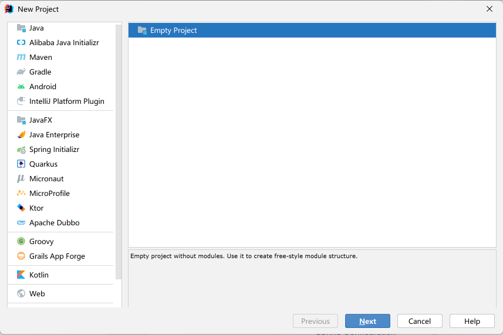
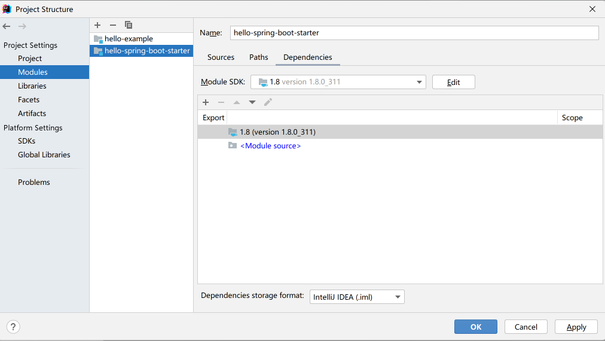
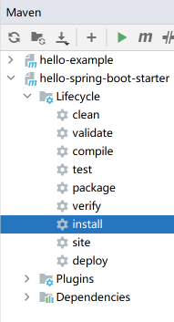

## Spring Boot 自定义 starter 


### 1. 机制

starter 是 SpringBoot 中一种非常重要的机制，它可以繁杂的配置统一集成到 starter 中，我们只需要通过 maven 将 starter 依赖引入到项目中，SpringBoot 就能自动扫描并加载相应的默认配置。starter 的出现让开发人员从繁琐的框架配置中解放出来，将更多的精力专注于业务逻辑的开发，极大的提高了开发效率。

### 2. 为什么要自定义starter

如今我们的服务几乎都是基于Spring Boot构建而来，我们可以将一些可独立于业务代码之外的功能和配置模块封装成一个个starter，SpringBoot会为我们完成自动装配，这样复用的时候只需要将其在pom中引用依赖即可。

### 3. 命名规则

为了区分官方提供的和第三方提供的，官方建议：

- SpringBoot官方提供的 starter 以 spring-boot-starter-xxx 的形式命名，例如：
  - spring-boot-starter-aop
  - spring-boot-starter-data-jdbc

- 第三方自定义的 starter 使用 xxx-spring-boot-starter 的形式命名，例如 ：
  - mybatis-spring-boot-starter
  - druid-spring-boot-starter

### 4. 创建步骤

自定义 starter 可以分为以下几步：

1. 创建工程
2. 添加 POM 依赖
3. 定义 propertie 类
4. 定义 Service 类
5. 定义配置类
6. 创建 spring.factories 文件
7. 构建 starter
8. 验证


#### 4.1 创建工程

1. 使用 IntelliJ IDEA 创建一个空项目（Empty Project），如下图。



2. 点击下图中+号，通过Spring Initializr 创建两个Spring Boot模块，一个 hello-spring-boot-starter 和一个 hello-example。




#### 4.2 添加 POM 依赖

在 hello-spring-boot-starter 中 pom.xml 中添加如下依赖：

```xml
<-- 核心启动器，包含自动配置，日志及yaml -->
<dependency>
	<groupId>org.springframework.boot</groupId>
    <artifactId>spring-boot-starter</artifactId>
</dependency>
```


#### 4.3 定义 properties类

如果我们需要从 application.yaml 或 application.properties 中拿到一些使用者配置的数据，那么我们就需要定义一个properties类。这个properties类主要作用是将 application.yaml 或 application.properties 中的配置信息映射成实体类，比如我们这里指定 prefix = "hello.test" 这样，我们就能将以hello.test为前缀的配置项拿到了。

> 这个注解不但能映射成String或基本类型的变量,还可以映射为List，Map等数据结构。 

```java
@ConfigurationProperties(prefix ="hello.test")
public class HelloProperties {
    private boolean enable;
    private String name;
    private String url;
}
```


#### 4.4 定义 Service 类

这个类不是自定义starter必须的，如果不需要定义上面的properties，那么这个Service类也不需要， 所以这个Service的目的是使用上面定义的properties类或供外部调用。

```java
public class HelloService {
    @Autowired
    private HelloProperties helloProperties;
    public String sayHello() {
        return "hello "+ helloProperties.getName() + " welcome to my homepage:" + helloProperties.getUrl();
    }
}
```


#### 4.5 定义配置类

HelloAutoConfiguration 使用了以下 5 个注解：

- @Configuration：表示该类是一个配置类；
- @EnableConfigurationProperties(xxxProperties.class)：该注解的作用是为 xxxProperties 开启属性配置功能，并将这个类以组件的形式注入到容器中；
- @ConditionalOnProperty(prefix = "xxx", name= "x", matchIfMissing = true) : 当指定的配置项等于你想要的时候，配置类生效；
- @ConditionalOnMissingBean(xxx.class)：该注解表示当容器中没有 xxx 类时，该方法才生效；
- @Bean：该注解用于将方法的返回值以 Bean 对象的形式添加到容器中。


```java
@Configuration
@EnableConfigurationProperties(HelloProperties.class)
@ConditionalOnProperty(prefix = "hello.test", name = "enable", matchIfMissing = true)
public class HelloAutoConfiguration {
    
    @Bean
    @ConditionalOnMissingBean(HelloService.class)
    public HelloService helloService() {
        return new HelloService();
    }
}
```


#### 4.6 创建 spring.factories文件

Spring Factories 机制是 Spring Boot 中的一种服务发现机制，这种扩展机制与 Java SPI 机制十分相似。Spring Boot 会自动扫描所有 Jar 包类路径下 META-INF/spring.factories 文件，并读取其中的内容，进行实例化，这种机制也是 Spring Boot Starter 的基础。因此我们自定义 starter 时，需要在项目类路径下创建一个 spring.factories 文件。

在 hello-spring-boot-starter 的路径下（resources ）中创建一个 META-INF 文件夹，并在 META-INF 文件夹中创建一个 spring.factories 文件。


将 Spring Boot 的 EnableAutoConfiguration 接口与自定义 starter 的自动配置类 HelloAutoConfiguration 组成一组键值对添加到 spring.factories 文件中，以方便 Spring Boot 在启动时，获取到自定义 starter 的自动配置:

```
org.springframework.boot.autoconfigure.EnableAutoConfiguration=\
com.example.hello.starter.config.HelloAutoConfiguration
```


#### 4.7 构建starter

Terminal 下进入到  hello-spring-boot-starter 下执行 `mvn clean install` 或者 如图：




### 5. 验证

#### 5.1 添加依赖

在hello-example下pom.xml中添加我们自定义的 hello-spring-boot-starter：

```
<dependency>
    <groupId>org.springframework.boot</groupId>
    <artifactId>spring-boot-starter-web</artifactId>
</dependency>
<dependency>
    <groupId>com.example</groupId>
    <artifactId>hello-spring-boot-starter</artifactId>
    <version>0.0.1-SNAPSHOT</version>
</dependency>
```


#### 5.2 配置信息

在 application.yaml 或 application.properties 中配置如下：

```
hello.test.enable=true
hello.test.name=Mr.Wang
hello.test.url=https://github.com/flyhero
```


#### 5.3 创建controller类

```java
@RestController
public class HelloController {

    @Autowired
    private HelloService helloService;

    @GetMapping("/test")
    public String test(){
        return helloService.sayHello();
    }
}
```

#### 5.4 请求接口

从相应的结果可知，我们定义的starter已经生效了。


