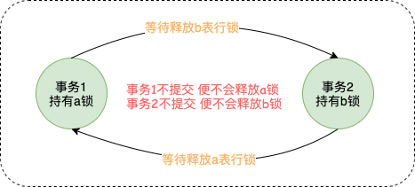

数据库死锁这个问题不知道你有没有遇到过呢？一旦遇到该如何排查问题呢？

>  环境: MySQL 5.7.25 引擎 InnoDB


如果你的系统日志突然报这种错误，就问你慌不慌？心想：MD，之前遇到过，但完全不记得该怎么办了！！！完了完了！被领导知道我解决不了这个问题，不会被开除吧！

```shell
2019-10-23 13:07:17.144 ERROR nested exception is org.springframework.dao.DeadlockLoserDataAccessException: 
### Error updating database.  Cause: com.mysql.cj.jdbc.exceptions.MySQLTransactionRollbackException: Deadlock found when trying to get lock; try restarting transaction
### The error may involve com.x.x.mapper.XMapper.update-Inline
### The error occurred while setting parameters
### SQL: UPDATE tb_a SET start_time = ?, end_time = ? WHERE  id = ?
### Cause: com.mysql.cj.jdbc.exceptions.MySQLTransactionRollbackException: Deadlock found when trying to get lock; try restarting transaction
com.mysql.cj.jdbc.exceptions.MySQLTransactionRollbackException: Deadlock found when trying to get lock; try restarting transaction
```

想我一个堂堂工作几年的开发者，挂在这个地方，那岂不是很没面子啊！操练起来。


## 什么是死锁？

当多个进程访问同一**数据库**时，其中每个进程拥有的**锁**都**是**其他进程所需的，由此造成每个进程都无法继续下去。 简单的说，进程A等待进程B释放他的资源，B又等待A释放他的资源，这样就互相等待就形成**死锁**。


## 查看数据库基本信息

查看数据库版本：`select version();`

事务隔离级别查询方法：`select @@tx_isolation`

通过命令`show engines`查看一下InnoDB的特点

| Engine | Support | Comment                                                    |
| :----: | ------- | ---------------------------------------------------------- |
| InnoDB | DEFAULT | Supports transactions, row-level locking, and foreign keys |
| MyISAM | YES     | MyISAM storage engine                                      |

InnoDB支持事务，行级锁及外键。

我们平时遇到的就是多个事务之间行级锁导致的。


## 分析

业务日志中的记录太过简单，只知道哪个方法的事务发生了死锁，没有多余的信息，所以我们要到数据库中寻找更多的有用信息，通过命令 `show engine Innodb status` 查看:

```shell
------------------------
LATEST DETECTED DEADLOCK
------------------------
2019-10-23 16:46:42 0x7fa919415700
# 事务1
*** (1) TRANSACTION:
TRANSACTION 21010939, ACTIVE 1 sec starting index read
mysql tables in use 1, locked 1
LOCK WAIT 4 lock struct(s), heap size 1136, 2 row lock(s), undo log entries 1
MySQL thread id 255825, OS thread handle 140363604055808, query id 179915249 localhost 127.0.0.1 root updating
UPDATE tb_b SET end_time = 1571821300000 WHERE id = 18199
# 等待b表的X锁
*** (1) WAITING FOR THIS LOCK TO BE GRANTED:
RECORD LOCKS space id 1924 page no 284 n bits 80 index PRIMARY of table `dmeeting`.`tb_b` trx id 21010939 lock_mode X locks rec but not gap waiting
Record lock, heap no 9 PHYSICAL RECORD: n_fields 26; compact format; info bits 0

# 事务2
*** (2) TRANSACTION:
TRANSACTION 21010938, ACTIVE 1 sec starting index read
mysql tables in use 1, locked 1
4 lock struct(s), heap size 1136, 2 row lock(s), undo log entries 1
MySQL thread id 255826, OS thread handle 140364249913088, query id 179915304 localhost 127.0.0.1 root updating
UPDATE tb_a SET  actual_start_time = 1571820362678, actual_end_time = null WHERE id = 14266
# 持有b表的X锁
*** (2) HOLDS THE LOCK(S):
RECORD LOCKS space id 1924 page no 284 n bits 80 index PRIMARY of table `dmeeting`.`tb_b` trx id 21010938 lock_mode X locks rec but not gap
Record lock, heap no 9 PHYSICAL RECORD: n_fields 26; compact format; info bits 0
# 等待a表的X锁
*** (2) WAITING FOR THIS LOCK TO BE GRANTED:
RECORD LOCKS space id 1934 page no 324 n bits 112 index PRIMARY of table `dmeeting`.`tb_a` trx id 21010938 lock_mode X locks rec but not gap waiting
Record lock, heap no 45 PHYSICAL RECORD: n_fields 38; compact format; info bits 0
# 回滚事务2
*** WE ROLL BACK TRANSACTION (2)
```

分析上面的死锁日志，能够得出以下死锁场景：

| 时间序列 |                            事务1                             |                            事务2                             |
| :------: | :----------------------------------------------------------: | :----------------------------------------------------------: |
|    1     |                      START TRANSACTION;                      |                      START TRANSACTION;                      |
|    2     |                                                              |                                                              |
|    3     |                                                              | UPDATE tb_b SET start_time = ?  WHERE  id = 18199<br />持有b表行级X锁 |
|    4     | UPDATE tb_b SET end_time = ?  WHERE id = 18199<br />申请b表行级X锁 |                                                              |
|    5     |                                                              | UPDATE tb_a SET actual_start_time = ?, actual_end_time = ? WHERE id = 14266<br />申请a表行级X锁 |
|    6     |                                                              | Deadlock found when trying to get lock; try restarting transaction(**Rollback**) |

仅仅根据死锁日志分析，我是百思不得其解，在事务1中并没有显示持有a表的X锁，那么这是怎么造成死锁的呢！我就是个愣头青，就知道面对死锁日志想来想去，浪费了时间，幸得身旁有大神指点，去看看业务系统中这两个事务代码，才发现原来事务1中在时间序列2时对a表进行了更新操作，已经持有了a表的行级锁！这下就完全明白了，两个事务互相等待对方释放锁，这就是造成死锁的原因。




原因知道了，那就通过更改代码，让两个事务里表更新的顺序一致即可。

## 总结排查步骤

1. 通过业务系统日志快速定位到发生死锁的代码块
2. 查看InnoDB的死锁日志，找出各个事务对应的代码块
3. 通过死锁日志和业务代码推测画出死锁的事务发生场景


## 降低发生死锁的概率

1. 避免大事务，可以拆分成多个小事务，因为大事务耗时长，与其他事务发生的概率就大。
2. 多个事务操作相同的一些资源，尽量保持顺序一致。
3. 更新语句尽量只更新必要的字段，内容相同的字段不要更新。


### 记录完整的死锁日志

`show engine innodb status` 时，显示的信息不全。

这是mysql客户端的一个bug：[BUG#19825](http://bugs.mysql.com/bug.php?id=19825)，交互式客户端限制了输出信息最大为 **64KB**，因此更多的信息无法显示。

但我们可以通过开启锁监控来查看完整的日志，方式如下：

```shell
# 建议排查问题后关闭，15秒输出一次，会导致日志越来越大
-- 开启标准监控 开ON/关OFF
set GLOBAL innodb_status_output=ON;
 
-- 开启锁监控  开ON/关OFF
set GLOBAL innodb_status_output_locks=ON;
```

也可以通过一个专门用于记录死锁日志的参数：

```shell
set GLOBAL innodb_print_all_deadlocks=ON;
```

内容一般输出到 mysql error log 里，查看日志位置：`select @@log_error`


## 锁的种类

### 锁级别

行级锁（引擎INNODB）：开销大，加锁慢；会出现死锁；锁定粒度最小，发生锁冲突的概率最低,并发度也最高。

表级锁（引擎MyISAM）：开销小，加锁快；不会出现死锁；锁定粒度大，发生锁冲突的概率最高,并发度最低。

 

### 锁类型

next KeyLocks锁，同时锁住记录(数据)，并且锁住记录前面的Gap    

Gap锁，不锁记录，仅仅记录前面的Gap

Recordlock锁（锁数据，不锁Gap）

所以其实 Next-KeyLocks=Gap锁+ Recordlock锁


### 锁模式

首先我们要知道两种最容易理解的锁模式，读加共享锁，写加排它锁。

- LOCK_S（读锁，共享锁）
- LOCK_X（写锁，排它锁）

还有：

- LOCK_IS（读意向锁）

- LOCK_IX（写意向锁）
- LOCK_AUTO_INC (自增锁)


> 更加详细的介绍可以去看看这篇文章：https://www.aneasystone.com/archives/2018/04/solving-dead-locks-four.html
>
> [http://www.throwable.club/2019/05/11/mysql-deadlock-troubleshoot-1st/#%E5%AF%BC%E8%87%B4%E6%AD%BB%E9%94%81%E7%9A%84%E5%8E%9F%E5%9B%A0](http://www.throwable.club/2019/05/11/mysql-deadlock-troubleshoot-1st/#导致死锁的原因)

