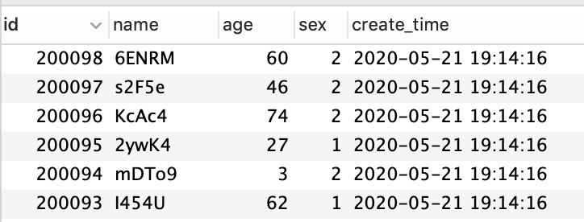
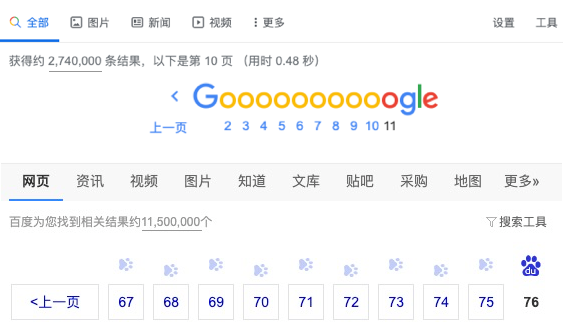

使用limit对大表进行分页时，如果偏移量过大，会导致扫描过多的行，从而导致查询效率低下。比如：` limit  M, N `  MySQL会扫描 M+N 行后，抛弃前面M行记录只返回后面N行记录。

我们通过一些测试数据来看下，往下表中随机插入20万测试数据：

然后我们来看下在没有优化limit的情况下偏移量大小对查询速度的影响：

|      | 查询语句                           | 耗时 |
| ---- | ---------------------------------- | ---- |
| 1    | select * from user limit 100,10    | 15ms |
| 2    | select * from user limit 100000,10 | 45ms |

从测试结果可知：**这种直接使用 limit M,N 的方式会全表扫描，随着数据量速度越来越慢，因此这种方式只适合数据量较少的情况下**；

针对这种情况可通过以下四种方法来进行优化：

一般我们分页查询都会使用使用查询条件和排序，那么我们可以建立索引来提升查询速度。

|      | 语句                                                         | 索引 | 速度  |
| ---- | ------------------------------------------------------------ | ---- | ----- |
| 1    | select * from user  where sex=2 order by age limit 100000,10; | 无   | 120ms |
| 2    | ……                                                           | 有   |       |

1. 业务上避免查询过多页的数据

   这是一种比较简单易用的实现方法，谁会在乎第1000页的记录是什么呢? 当然这种方式是在你能够说服产品的基础上。

   

2. 将limit转换为已知的位置查询between and

   如果你的查询条件是有序的且没有中断过的，可以通过记录上次访问的序号，当下次继续访问时便可以带上

   因为要求查询条件有序，所以应用不太广泛。

3. 延迟关联，利用覆盖索引查询及子查询

   如果查询较为简单，通过这种延迟关联也能提升查询效率；在子查询中只查询出主键，然后关联查询其他字段，这样可以有效减少回表次数。

4. 通过上次查询的最后位置，设置where条件

   