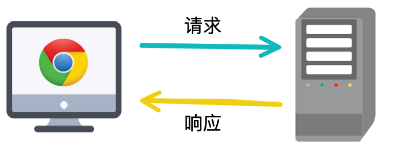
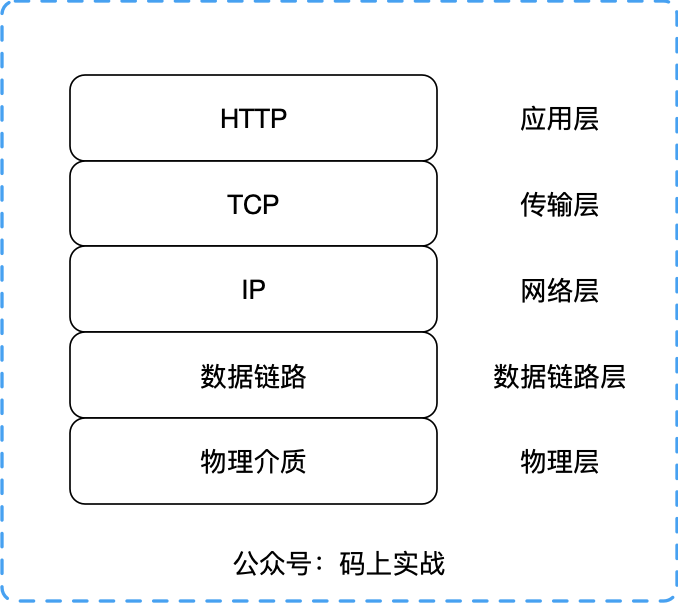
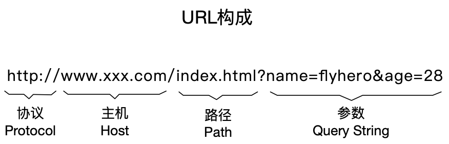
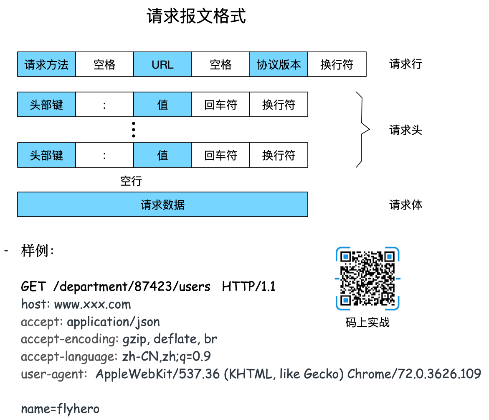

面试一年多，每当我问起面试者对HTTP的了解时，个个回答令我瞠目结舌，这些开发者都有3-5年的经验。请不要让我叫你野生程序员，是时候了解HTTP了，让我们当个正规军。

<!--more-->

## 起因
面试官：请问你了解HTTP协议吗？

前端开发：这不是应该后端清楚的吗？

后端开发：这不是前端知道的吗？ 

面试官：……

我们先一本正经的来了解下HTTP（不包含传输层TCP），然后总结其中的精华回复面试官。

## HTTP协议简介

HTTP（超文本传输协议）是应用层上的一种客户端/服务端模型的通信协议,它由请求和响应构成，且是无状态的。（暂不介绍HTTP2）

- 协议

    协议规定了通信双方必须遵循的数据传输格式，这样通信双方按照约定的格式才能准确的通信。

- 无状态

    无状态是指两次连接通信之间是没有任何关系的，每次都是一个新的连接，服务端不会记录前后的请求信息。

- 客户端/服务端模型

## 五层网络模型

## URL构成
用了这么久，你注意过吗？

## 协议内容
### 请求（Request）
客户端发送一个HTTP请求到服务端的格式：

- 请求行
- 请求头
- 请求体

### 响应（Response）
服务端响应客户端格式：
- 状态行
- 响应头
- 响应体

### 状态码

HTTP状态码由三个十进制数字组成，第一个十进制数字定义了状态码的类型，后两个数字没有分类的作用。HTTP状态码共分为5种类型：

 分类 | 分类描述 
---|---
1xx | 信息，服务器收到请求，需要请求者继续执行操作 
2xx | 成功，操作被成功接收并处理 
3xx | 重定向，需要进一步的操作以完成请求 
4xx | 客户端错误，请求包含语法错误或无法完成请求 
5xx | 服务器错误，服务器在处理请求的过程中发生了错误 

更详细的状态码可查看 [HTTP状态码](https://developer.mozilla.org/zh-CN/docs/Web/HTTP/Status)

但一般我们只需要知道几个常见的就行，比如 200，400，401，403，404，500，502.

### 请求方法

截止到HTTP1.1共有下面几种方法：

 方法 | 描述 
---|---
 GET | GET请求会显示请求指定的资源。一般来说GET方法应该只用于数据的读取，而不应当用于会产生副作用的非幂等的操作中。它期望的应该是而且应该是安全的和幂等的。这里的安全指的是，请求不会影响到资源的状态。 
POST | 向指定资源提交数据进行处理请求（例如提交表单或者上传文件）。数据被包含在请求体中。POST请求可能会导致新的资源的建立和/或已有资源的修改。 
PUT | PUT请求会身向指定资源位置上传其最新内容，PUT方法是幂等的方法。通过该方法客户端可以将指定资源的最新数据传送给服务器取代指定的资源的内容。 当资源不存在时，创建一个新的资源。
PATCH | PATCH方法出现的较晚，它在2010年的RFC 5789标准中被定义。PATCH请求与PUT请求类似，同样用于资源的更新。二者有点不同：PATCH一般用于资源的部分更新，而PUT一般用于资源的整体更新。当资源不存在时，创建一个新的资源
DELETE | DELETE请求用于请求服务器删除所请求URI（统一资源标识符，Uniform Resource Identifier）所标识的资源。DELETE请求后指定资源会被删除，DELETE方法也是幂等的。 
 OPTIONS | 允许客户端查看服务器的性能和服务端支持的请求方法。 
CONNECT | HTTP/1.1协议中预留给能够将连接改为管道方式的代理服务器。  
HEAD | 类似于get请求，只不过返回的响应中没有具体的内容，用于获取报头    
TRACE | 回显服务器收到的请求，主要用于测试或诊断。 

### 请求和响应常见通用头

| 名称 | 作用 |
| --- | --- |
| Content-Type | 请求体/响应体的类型，如：text/plain、application/json |
| Accept | 说明接收的类型，可以多个值，用`,`(半角逗号)分开 |
| Content-Length | 请求体/响应体的长度，单位字节 |
| Content-Encoding | 请求体/响应体的编码格式，如gzip,deflate |
| Accept-Encoding | 告知对方我方接受的Content-Encoding |
| ETag | 给当前资源的标识，和`Last-Modified`、`If-None-Match`、`If-Modified-Since`配合，用于缓存控制 |
| Cache-Control | 取值为一般为`no-cache`或`max-age=XX`，XX为个整数，表示该资源缓存有效期(秒) |

#### 注意
Content-Type，内容类型，一般是指网页中存在的Content-Type，用于定义网络文件的类型和网页的编码，决定浏览器将以什么形式、什么编码读取这个文件。

常见的媒体格式类型如下：

Content-Type(Mime-Type) |描述
---|---
text/html | HTML格式
text/plain |纯文本格式
text/xml | XML格式
image/gif |gif图片格式
image/jpeg |jpg图片格式
image/png| png图片格式

以application开头的媒体格式类型：

Content-Type(Mime-Type) |描述
---|---
application/xml | XML数据格式
application/json |  JSON数据格式
application/pdf | pdf格式
application/msword |  Word文档格式
application/octet-stream |  二进制流数据（如常见的文件下载）
application/x-www-form-urlencoded | form表单数据被编码为key/value格式发送到服务器（表单默认的提交数据的格式）
multipart/form-data |  需要在表单中进行文件上传时，就需要使用该格式

###  常见请求头

| 名称 | 作用 |
| --- | --- |
| Authorization | 用于设置身份认证信息 |
| User-Agent | 用户标识，如：OS和浏览器的类型和版本 |
| If-Modified-Since | 值为上一次服务器返回的 `Last-Modified` 值，用于确认某个资源是否被更改过，没有更改过(304)就从缓存中读取 |
| If-None-Match | 值为上一次服务器返回的 ETag 值，一般会和`If-Modified-Since`一起出现 |
| Cookie | 已有的Cookie |
| Referer | 表示请求引用自哪个地址，比如你从页面A跳转到页面B时，值为页面A的地址 |
| Host | 请求的主机和端口号 |

### 常见响应头

| 名称 | 作用 |
| --- | --- |
| Date | 服务器的日期 |
| Last-Modified | 该资源最后被修改时间 |
| Transfer-Encoding | 取值为一般为chunked，出现在Content-Length不能确定的情况下，表示服务器不知道响应版体的数据大小，一般同时还会出现`Content-Encoding`响应头 |
| Set-Cookie | 设置Cookie |
| Location | 重定向到另一个URL，如输入浏览器就输入[baidu.com](http://baidu.com)回车，会自动跳到 [https://www.baidu.com](https://www.baidu.com) ，就是通过这个响应头控制的 |
| Server | 后台服务器 |

## 总结
清楚的知道这些内容，不仅仅是为了应对面试官，而是能实实在在的提高自己的效率，这一点在前后端联调接口最明显,当你在应用中去请求其他接口或转发请求时这些也是要知道的。不然出现问题的概率会大大提高。