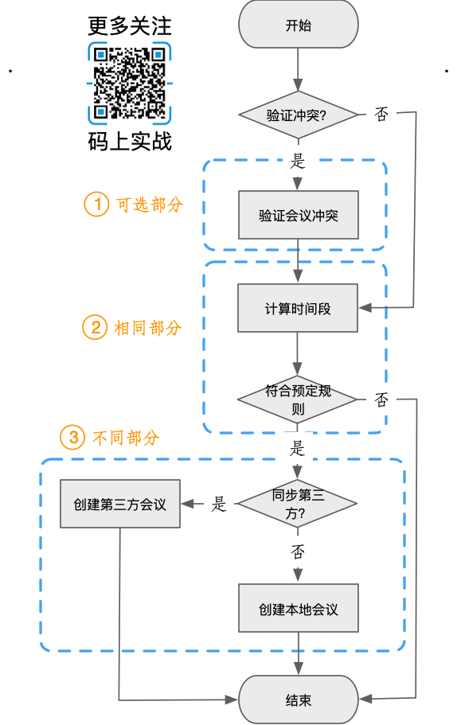

如果不在工作中思考，模板方法模式的概念和定义即使背再多遍估计也是徒劳，今天我思考如何解决实际项目中的问题时发现，模板方法正是解决问题的良策。

<!--more-->

## 需求

我们项目中要实现一个创建会议的需求，但我们系统可设置将会议同步到其他第三方系统中。而在创建会议前要经过几个必须的步骤，比如验证冲突，计算循环规则，对比时间段是否符合等。


## 思路

###  不同点

创建会议的方式不同：
- 本地系统创建
- 第三方系统创建

###  相同点

1. 验证会议是否冲突
2. 根据循环规则计算出预定时间段
3. 是否符合预定规则

### 特殊点

即使会议又冲突，但有需求是依然要能创建成功！所以验证冲突步骤是可选的。

业务梳理后如下：



### 开始抽象

只有抽象类能实现我们的要求，既能要一部分方法有实现又能实现抽象方法不用实现。

```java
@Slf4j
public abstract class AbstarctRecurringHandler {

    /**
     * 处理创建会议
     */
    public final void handle() {
        if (isConfirm()) {
            calculateConflict();
        }
        calcBookingPeriod();
        checkRule();
        createEvent();
    }

    /**
     * 验证规则
     */
    public void checkRule() {}

    /**
     * 获取预定的所有会议时间段
     *
     * @return
     */
    public List<Period> calcBookingPeriod() {}

    /**
     * 计算冲突会议
     */
    public void calculateConflict() {}

    /**
     * 钩子方法
     *
     * @return
     */
    public abstract boolean isConfirm();

    public abstract void createEvent();
}
 
```

- 模板方法

我们这里的handle方法已经固定了整个创建会议的流程，并且我们使用final修饰，表示不允许别人修改这个过程。
不同的创建可能有不同的人来完成，这个能够避免部分人员的粗心大意也就是规范了创建流程，而且其他开发人员也不必再关心除创建会议之外的其他过程。

- 钩子方法

虽然我们的创建会议的整体过程不允许修改，但部分功能可能有所不同，所以我们需要钩子方法来使部分功能可选或者改变部分流程。钩子方法可使用默认值，也可由子类来决定是否改变。

#### 两种不同的实现

两个子类唯一的职责就只剩单纯的创建功能。

- 本地创建

```java
@Slf4j
@Service
public class LocalRecurringHandler extends AbstarctRecurringHandler {

    /**
     * 钩子方法
     *
     * @return
     */
    @Override
    public boolean isConfirm() {
        return true;
    }

    @Override
    public void createEvent() {
        //创建本地会议
    }

}

```

- 第三方创建

```java
@Slf4j
@Service
public class EwsRecurringHandler extends AbstarctRecurringHandler {

    /**
     * 钩子方法
     *
     * @return
     */
    @Override
    public boolean isConfirm() {
        return false;
    }

    @Override
    public void createEvent() {
        //创建本地会议
    }

}
```

## 模板方法定义

定义一个操作中的算法的骨架，而将一些步骤延迟到子类中。模板方法使得子类可以不改变一个算法的结构即可重定义该算法的某些特定步骤。


## 角色

模板方法模式涉及到的角色有：

- 抽象模板角色

    定义一组基本方法供子类实现，定义并实现组合了基本方法的模板方法。

- 具体模板角色

    实现抽象模板角色定义的基本方法。

## 总结
### 好处

- 提高代码的复用性

    相同的代码放到了抽象类中,复用且可维护性强。
    
- 具有一定的扩展性

    不同的实现交由子类来自行实现，用子类来进行扩展。
    
- 反向控制

    行为由父类控制，子类实现。


实践要在理论的基础之上，所以理论基础也是非常重要的。


